## I0U19A<br/>Management of large-scale omics data

Prof Jan Aerts, [VDA-lab](http://vda-lab.be), KU Leuven<br/>
jan.aerts@kuleuven.be<br/>
http://teaching.vda-lab.be


--NEWV
Overview of the course


--NEWV
Website

[http://teaching.vda-lab.be/](http://teaching.vda-lab.be)

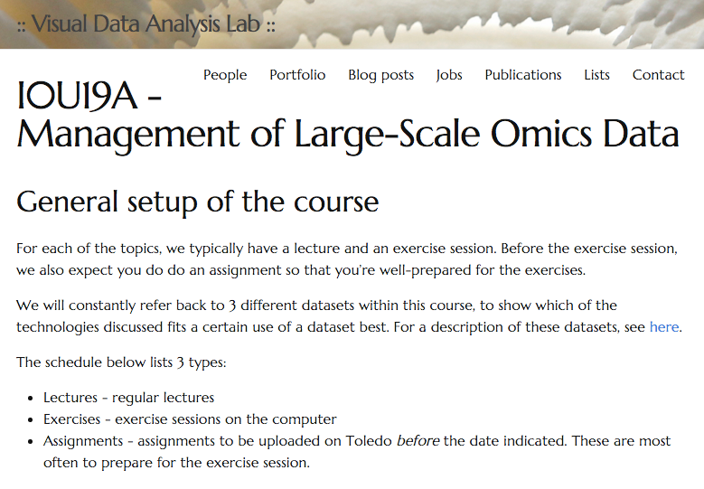

--NEWV
Schedule

See [http://teaching.vda-lab.be/](http://teaching.vda-lab.be)

--NEWV
**Exercises and assignments**

Three datasets

* genotypes
* beers in Belgium
* approved drugs

Modelled and stored using different database technologies => which technology (or combination of technologies) fits a particular (and its intended use) best?

Preparation of exercise session: **assignment** including e.g. modelling of data => answers will be used in exercise session

--NEWV
**Docker**

Exercises will be run on your own laptops.

Need to install docker: https://www.docker.com/

--NEWV
**Evaluation**

Combination of:

* permanent evaluation (including preparation of exercise sessions): 10%
* take-home data visualization assignment: 20%
* open-book written exam: 70%

At least 8/20 for each.

--NEWV
**Books**

* Marz N & Warren J (2013). *Big Data*. Manning Publications.
* McCreary D & Kelly A (2013). *Making Sense of NoSQL*. Manning Publications.
* Wood D, Zaidman M & Ruth L (2013). *Linked Data*. Manning Publications.


--NEWV
**Your background**

* scripting?
* SQL?

--NEWV
**Today - What is Big Data?**

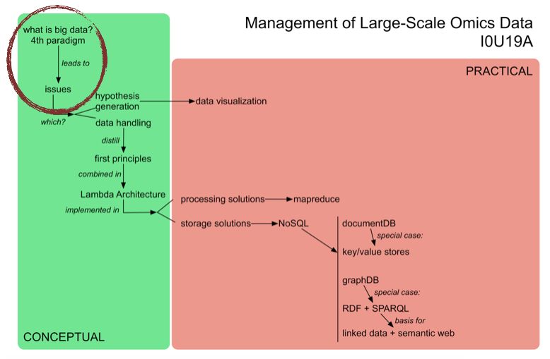

--NEWH
## What is Big Data?

--NEWV
How would you describe "big data"?

Can you give examples?

--NEWV
* **Netflix** - analysis of traffic patterns across device types to improve reliability of video streaming; recommendation engine based on viewing habits
* **Politics**: project "Narwhal" - Obama campaign operations: don't knock on door of people who have already volunteered, don't send email asking for money to people who already contributed
* **WeatherSignal** - repurposes sensors in Android smartphones to map atmospheric readings (barometer, hygrometer, ambient thermometer, light meter)

--NEWV
* **Infectious diseases**: Spatio-temporal Epidemiological Modeler STEM - IBM uses local climate and temperature to find correlations with how malaria spreads => used to predict location of future outbreaks
* **Retail** (Target) - predict future purchasing habits (e.g. pregnancy) => targeted ads

--NEWV
**Why are these examples different?**

* "Data-first"
* Data collection is easy
* Data is often unstructured
* Data can be used for many things

Example datasets available at [http://www.datasciencecentral.com/profiles/blogs/big-data-sets-available-for-free](http://www.datasciencecentral.com/profiles/blogs/big-data-sets-available-for-free) and [https://snap.stanford.edu/data/loc-gowalla.html](https://snap.stanford.edu/data/loc-gowalla.html)

--NEWV
**Big Data, the bigger picture**

"Fourth Paradigm" of scientific research (Jim Grey, Microsoft)


--NEWV
| | | |
|-|-|-|
| 1st | 1,000s years ago | observe, then derive |
| 2nd | 100s years ago | derive, then observe |
| 3rd | last few decades | simulate |
| 4rd | today | measure |

--NEWV
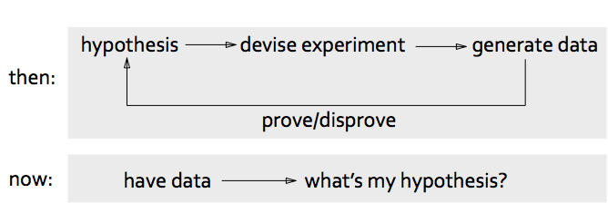

*data analysis*: moving from **hypothesis-first** to **data-first**

*challenge*: moving from **finding the right answer to a question** to **finding the right question given the data**

--NEWV
big data = data that exceeds processing capacity of conventional database systems (too big, moves too fast, doesn't fit in database structure)

Being able to process every item of data in reasonable time removes the troublesome need for sampling

Necessary counterpart: *agility* - successful exploitation of big data requires experimentation and exploration

Because it's big: *bring computation to the data* instead of the data to the computation

*Different way of thinking*

--NEWH
## The Three V's

--NEWV
**Volume**

= most immediate challenge to conventional IT structures; principle of big data: *if you can, keep everything*

* needs *scalable storage* + *distributed querying*
* structured vs unstructured data -> Hadoop: MapReduce + HDFS
  * MapReduce: *map* = distributing a dataset among multiple servers and operating on the data; *reduce* = recombining the partial results
  * HDFS = Hadoop Distributed File systems
  * Hadoop: for batch jobs (not interactive)

--NEWV
**Variety**

Data is messy

* 80% of effort in dealing with data = cleaning up
* process of moving from source data to processed application data involves loss of information
* relational databases: not always best destination for the data, even when tidied up (network data -> graph database; XML data -> dedicated XML store, ...)

--NEWV
* disadvantage of relational database: fixed schema <=> results of computations will evolve with detection and extraction of more signals => semi-structured NoSQL databases provide this flexibility: provide enough structure to organize data but do not require the exact schema of the data before storing it

--NEWV
**Velocity**

Increasing rate at which data flows into an organization, but also of system's output

* *input* (velocity of incoming data), and *throughput* (speed of taking data from input through to decision)
* often not possible to simply wait for a report to run or Hadoop job to be complete
* *streaming*: important to consider, because (1) if input data too fast to store in its entirety (e.g. Large Hedron Collider @ CERN); (2) application might mandate immediate response to the data

=> need for speed (--> has driven development of key-value stores and column databases)

--NEWH
## RDBMS refresher

Switch to [http://vda-lab.be/2015/02/introduction-to-relational-databases](http://vda-lab.be/2015/02/introduction-to-relational-databases)

--NEWV
Why do relational databases break down with big data?

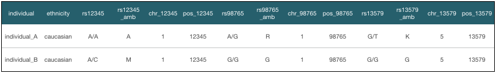

--NEWV
"Normal forms"


--NEWV


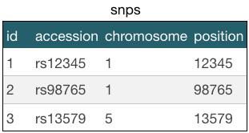

--NEWV
### 1. Querying scalability

Database schema normalization: every piece of information of is stored only once

=> makes updating data easier and safer

=> requires less space (!)

--NEWV
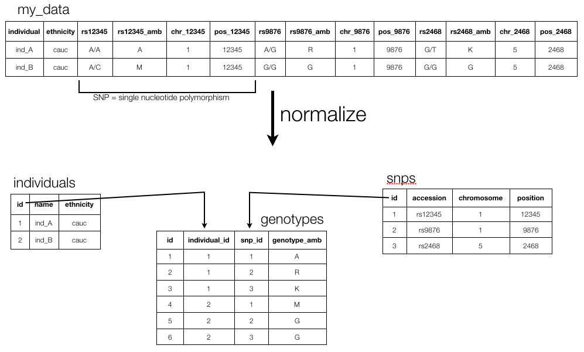

--NEWV
* *advantage* of normalized database: you can ask any question
* *disadvantage* of normalized database: to get an answer you will have to *join* tables => is expensive (i.e. become *very* slow) if you have to combine many large tables (millions of rows)

For example: Return all names of individuals that have heterozygous SNPs on chromosome 1

```
SELECT DISTINCT i.name
FROM individuals i, snps s, genotypes g
WHERE i.id = g.individual_id                    <== join
AND s.id = g.snp_id                             <== join
AND s.chromosome = 1
AND g.genotype_amb NOT IN ("A","C","G","T");
```

--NEWV
Solution: **de-normalize**

Getting exon positions for a gene in *Ensembl* (= normalized database; 74 tables)<br/>
<small>`/usr/local/mysql/bin/mysql -u anonymous -h ensembldb.ensembl.org homo_sapiens_core_78_38`</small>


--NEWV
```
SELECT g.description, e.seq_region_start
FROM gene g, transcript t, exon_transcript et, exon e
WHERE g.gene_id = t.gene_id
AND t.transcript_id = et.transcript_id
AND et.exon_id = e.exon_id
AND g.description LIKE "FAM170B %";
```

<small>
```
+-------------------------+------------------+
| description             | seq_region_start |
+-------------------------+------------------+
| FAM170B antisense RNA 1 |         49121839 |
| FAM170B antisense RNA 1 |         49135656 |
| FAM170B antisense RNA 1 |         49141253 |
| FAM170B antisense RNA 1 |         49142930 |
| FAM170B antisense RNA 1 |         49145782 |
| FAM170B antisense RNA 1 |         49150805 |
| FAM170B antisense RNA 1 |         49121844 |
| FAM170B antisense RNA 1 |         49141253 |
| FAM170B antisense RNA 1 |         49142930 |
| FAM170B antisense RNA 1 |         49145782 |
| FAM170B antisense RNA 1 |         49148607 |
| FAM170B antisense RNA 1 |         49150805 |
| FAM170B antisense RNA 1 |         49122086 |
| FAM170B antisense RNA 1 |         49135877 |
| FAM170B antisense RNA 1 |         49141253 |
| FAM170B antisense RNA 1 |         49137495 |
| FAM170B antisense RNA 1 |         49141253 |
| FAM170B antisense RNA 1 |         49150805 |
+-------------------------+------------------+

18 rows in set (0.08 sec)
```
</small>

--NEWV
Getting exon positions for a gene in *UCSC* (= **de**-normalized database; 10,014 tables!)<br/>
<small>`/usr/local/mysql/bin/mysql -u genome -h genome-mysql.cse.ucsc.edu -A hg19`</small>

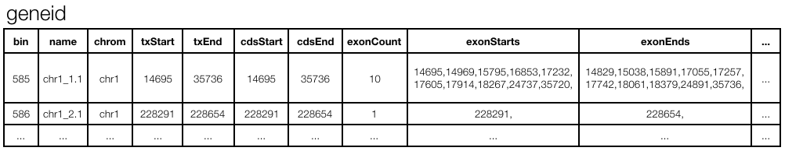

```
SELECT exonStarts
FROM gene_id
WHERE name = "chr1_1.1";
```

<small>
```
+--------------------------------------------------------------+
| exonStarts                                                   |
+--------------------------------------------------------------+
| 14695,14969,15795,16853,17232,17605,17914,18267,24737,35720, |
+--------------------------------------------------------------+

```
</small>

--NEWV
**Star schema**

Enables fast querying of data by minimizing joing (necessary in normalized schema)

2 attributes: (1) always 2 levels deep; (2) contains only one large table that is the focus of the model (**fact table**) plus >1 **dimension tables**

Database using start schema = *reporting* database (OLAP; != the authoritative source of the data) => temporarily forget the rules of normalization

Signals that you deviate from true star schema: (1) desire to retain the relationship between dimensions (= "snowflaking"); (2) existence of more than one fact table

--NEWV


--NEWV
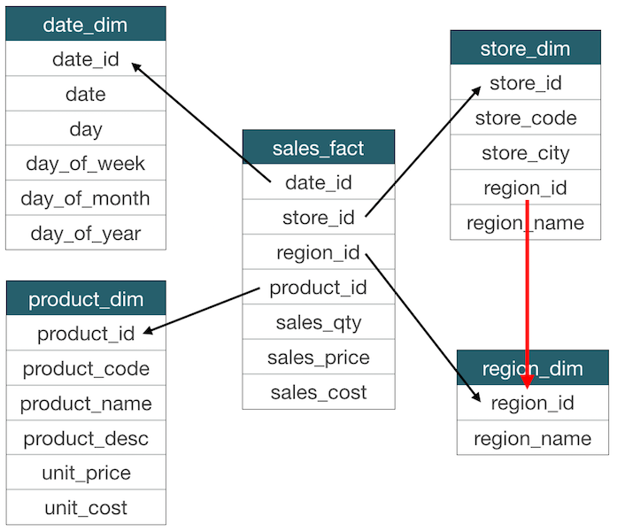

--NEWV
**How did we go from relational to star schema?**

Everything revolves around sales => base the fact table on the sales table (one row in fact table = one row in sales table)

Flattened the relationships all the way up the relational foreign key chain => keys in all reference tables become foreign keys in the fact table.

Create dimensions for the data pointed to by each of the foreign keys.

--NEWV
**Exercise**

Draw a star design to optimize analysis of the data stored in a database that looks like this, when you're interested in the genotypes.


--NEWV
### 2. Writing scalability

Suppose you're writing a tool to store genomic variants as they are identified in a large number of `.bam` files into a relational database

<small>

| column name | type |
|-|-|
| sample ID | varchar(255) |
| chromosome | char(5) |
| position | integer |
| reference allele | char(1) |
| alternative allele | char(1) |
| genotype | char(2) |

</small>

=> `Timeout error on inserting to database`

--NEWV
Solution 1: **queuing**

Wasteful to only do a single insert at a time => batch many inserts in a single request => no timeouts anymore (but queue will get longer)

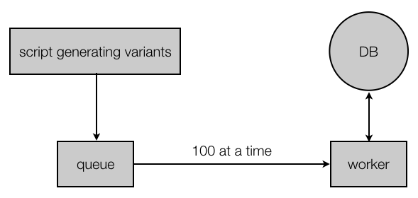

With ever bigger loads: again bottleneck DB

--NEWV
Solution 2: **sharding**

User multiple database servers, each with a subset of the data (= "**horizontal partitioning**" of "**sharding**")

e.g. 1 server per chromosome

But:

* all your application code needs to know how to find the shard for each key
* when databases too big again: split shards (e.g. p- vs q-arm, per Mb, ...)
* if so: need to update all application code that interacts with DB

--NEWV
**General challenges** concerning storage and writing:

* **Fault-tolerance is hard**: as number of machines increases => higher chance that one of them goes down
* **Complexity is pushed to application layer**: distributed nature of your data is not abstracted away from you (sharding)
* **Lack of human fault-tolerance**: system must be carefully thought out to limit the damage a human mistake can cause
* **Maintenance** is an enormous amout of work (re-sharding!)

--NEWH
## First principles for Big Data

--NEWV
Need to ask ourselves: "At the most fundamental level, what does a data system do?"

Data systems don't just memorize and regurgitate information. They combine bits and pieces together to produce answers.

Not all bits of information are equal: some is derived from other => what is the most raw form of information? (NGS sequencing data: bam? fastq? images?)

You answer questions on your data by running functions that take data as input. => **query = function(all data)** => goal of data system = compute arbitrary functions on arbitrary data

--NEWV
**Big Data properties**

* Computational systems should be **self-aware** of their distributed nature => sharing, replication, ... are handled for you
* Data is **immutable** => when you make a mistake you might write bad data but at least you didn't destroy good data => human fault-tolerant
* Is **general** and allows **ad hoc queries**

--NEWV
* Is **scalable**: maintains performance with increasing data and/or load by just adding resources to the system
* Is **extensible**: makes it easy to do large-scale migrations
* Requires **minimal maintenance** (= the work required to keep a system running smoothly) => choos componenets that have a small *implementation complexity*: rely on simple algorithms and components
  * Common trick: push complexity out of the core components and into pieces of the system whose outputs are discarded after a few hours (see later: speed layer)
* Is **debuggable**: be able to trace for each value in the system exactly what caused it to have that value


--NEWV
**Data immutability**

No more updates!

How to store the number of friends in a social graph?

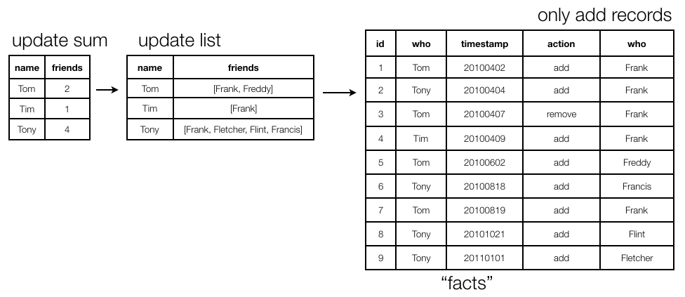

--NEWH
## Exercises

Using docker images

--NEWV
**Exercise 1 - data modelling**

Suppose you need to work on a social graph and the data is stored in a relational database. People have names, and know other people. Every "know" is reciprocal (so if I know you then you know me too).

Let's see what it means to follow relationships in a RDBMS.

--NEWV
The data is stored in a relational table called `friends` like this:


Exercise: write the SQL query to find all friends of friends of James. (Bonus: a query to find all friends of friends of James)

--NEWV
**Exercise 2 - genome browsers**

Most-user online genome browsers:

* Ensembl [http://www.ensembl.org](http://www.ensembl.org)
* UCSC [http://genome.ucsc.edu](http://genome.ucsc.edu)

--NEWV
Ensembl

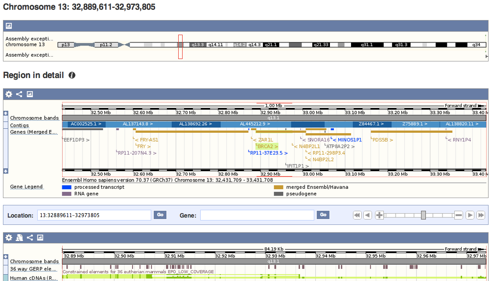

--NEWV
UCSC


--NEWV
**Getting to the underlying genome browser data**

Both use relational databases underneath the browser:

* `mysql -h ensembldb.ensembl.org -P 5306 -u anonymous homo_sapiens_core_70_37`
* `mysql --user=genome --host=genome-mysql.cse.ucsc.edu -H hg19`

--NEWV
**What's the main difference?**

* Log into the **Ensembl** database with mysql using the commands shown before.
* Get an idea of how the data is stored.

```
show tables;
SELECT * FROM gene LIMIT 2;
SELECT * FROM exon LIMIT 2;
SELECT * FROM transcript LIMIT 2;
SELECT * FROM exon_transcript LIMIT 2;
```

--NEWV
Now do the same for the **UCSC** database:

* Log into the database using the command shown above.
* Get an idea of how the data is stored.

```
show tables;
SELECT * FROM refGene LIMIT 2;
```

What's the difference in the way they store the information?
