## I0U19A<br/>Management of large-scale omics data

Prof Jan Aerts, [VDA-lab](http://vda-lab.be), KU Leuven<br/>
jan.aerts@kuleuven.be<br/>
http://teaching.vda-lab.be


--NEWV
Today - Lambda architecture

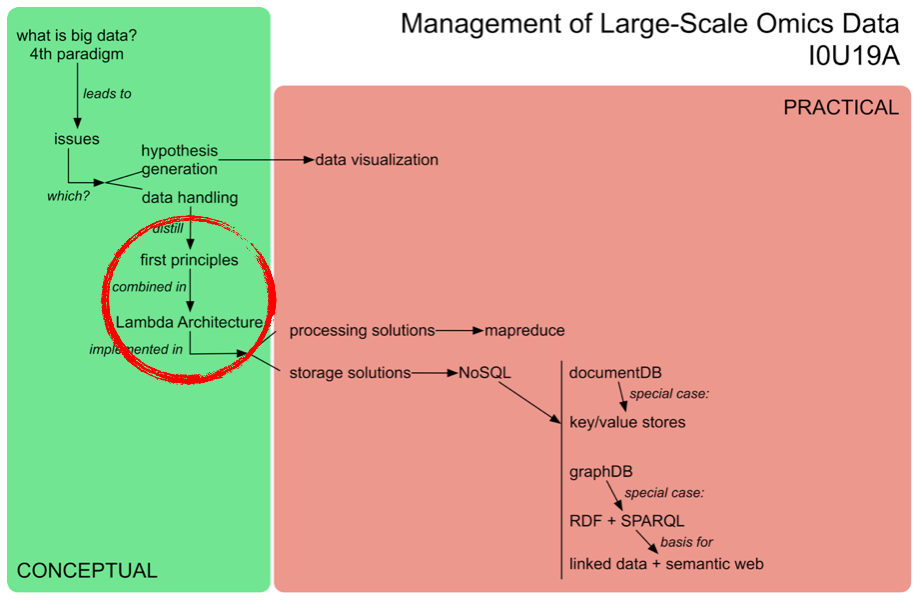

--NEWV
**Batch vs real-time**

Example Ensembl vs UCSC database showed that:

* Ensembl database allows for wider diversity of queries, but is therefore slower
* UCSC database is optimized for speed (in a genome browser), but is less ideal for custom queries

Issue gets more prominent once we get to really large datasets => we need a system that can compute any query (**query = function(all data)**) but at the same time be fast enough to allow interactivity (low latency)

--NEWV


vs

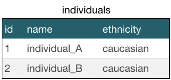
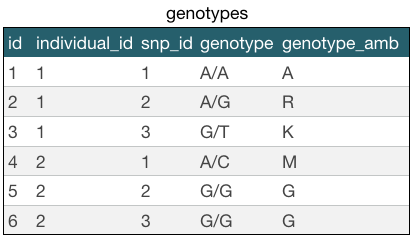


--NEWH
## Layers in Lambda Architecture

--NEWV
No single tool can provide a complete solution => use a variety of tools and techniques to build a complete Big Data system

Lambda Architecture: decomposes the problem of computing arbitrary functions on arbitrary data in real-time by decomposing it into 3 layers:

1. **batch layer** (least complex)
2. **serving layer**
3. **speed layer** (most complex)

--NEWV


<small>Lambda Architecture diagram (from Big Data, Marz & Warren)</small>

--NEWV
### 1. Batch layer

Needs to be able to (1) **store** an **immutable**, constantly growing **master dataset**, and (2) compute **arbitrary functions** on that dataset

"batch processing systems", e.g. Hadoop

Continuously **recomputes** "views" that are exposed in the serving layer => "**batch views**"

Very **simple**: computations are single-threaded programs, but automatically parallelize across a cluster => scales to datasets of any size

--NEWV
### 2. Serving layer

Load views from batch layer and make them queryable through indexing

Together with batch layer: satisfy almost all properties we need

Only requires batch updates and random reads (does not need to support random writes)

--NEWV


--NEWV
**Batch and serving layers satisfy almost all properties**

* **robust & fault tolerant**: simple system; views can be recomputated; easily distributable
* **scalable**: can be implemented as fully distributed systems
* **general**: can compute and update arbitrary views of arbitrary data
* **extensible**: adding new view = adding new function on data
* **allows ad hoc queries**: batch view allows any function
* **minimal maintenance**: very few pieces
* **debuggable**: you always have the inputs and outputs of computations run on the batch layer (<-> traditional DBs: you *update* the data)

--NEWV


--NEWV
Serving layer provides low-latency access to results of calculations performed on master dataset. Serving layer views are slightly out-of-date due to time required for batch computation.

--NEWV
### 3. Speed layer

Serving layer updates whenever batch layer finishes precomputing views => the only data not represented in the batch views is the data that came in while the precomputation was running

=> only have to compensate for these last few minutes/hours of data

speed layer is similar to batch layer: produces views based on data it receives

--NEWV


--NEWV
* Fundamental different approach than batch and serving layers: **incremental updates** (<-> batch/serving: **recomputation updates**)
* Consequence: significantly more complex!
  * reason: needs random reads and random writes
* Fortunately: narrow requirements => important **advantages**:
  * speed layer is only responsible for data that is not yet included in serving layer => vastly **smaller dataset**
  * speed layer views are transient => any **errors are short-lived**

--NEWV
* **complexity isolation**: complexity is pushed into a layer whose results are only temporary
* last piece of Lambda Architecture: merging results from serving and speed layers

--NEWV
**How to compute real-time views**

* naive approach: same *recomputation* function as batch layer, but only on recent data => real-time view = function(recent data)
* problem: will still have some latency => sub-second speed is difficult

=> we need *incremental algorithm*: does not need to constantly recompute when new data arrives

--NEWV


--NEWV
**How to store real-time views**

Storage layer must must these requirements:
* *random reads*: data must be indexed
* *random writes*: must be possible to identify a real-time view with low latency
* *scalability*: real-time views can be distributes across many machines
* *fault tolerance*: data must be replicated across machines in case one machine fails

--NEWV


--NEWV
**Eventual accuracy**

Often very difficult to incrementally compute functions which are easily computed in batch (e.g. word count)

Possible approach: *approximate* the correct answer:

* will be continuously corrected through batch/serving
* common with sophisticated queries such as those requiring real-time machine learning

--NEWV
**Asynchronous vs synchronous updates**

**Synchronous** update: application issues request directly to the database and *blocks* until the update is processed

Update can be coordinated with other aspects of the application (such as displaying a spinning cursor while waiting for the update to complete)


--NEWV
**Asynchronous** update: put in *queue*

Impossible to coordinate with other actions since you cannot control when they are executed

Advantages: greatly increases throughput + can handle varying load more easily


--NEWV
**When to use synchronous vs asynchronous?**

**Synchronous** update: typical for transactional systems that interact with users and require coordination with user interface

**Asynchronous** update: typical for analytics-oriented workloads or workloads not requiring coordination

Asynchronous is architecturally simpler => use asynchronous unless you have a good reason not to do so

--NEWV
**How to expire real-time views**

Once batch computation run finishes: you can discard a portion of the speed layer views, but you need to keep everything else => what exactly needs to be expired?

--NEWV
Suppose: just turned on application => no data<br/>
=> when batch layer runs **first**: operates on no data<br/>
=> if batch takes 10 minutes: when finished: batch views empty + 10min worth of data in speed


--NEWV
=> **2nd batch run** starts immediately after 1st<br/>
=> say 2nd run takes 15 minutes => when finished: batch view coverst 1st 10 minutes + speed layer views represent 25 minutes of data<br/>
=> first 10 minutes can be expired


--NEWV
=> **3rd batch run** starts immediately after 2nd<br/>
=> say 3rd run takes 18 minutes<br/>
=> just after 3rd run started: speed layer responsible for single run (i.e. 2nd)<br/>
=> just *before* completion: speed layer responsible for data that accumulated in previous 2 requirements<br/>
=> when 3rd run completes: data from 3 runs ago can be discarded


--NEWV
Simplest way to do this: maintain *two* sets of real-time views and alternate clearing them after each batch run

=> after each batch layer run: application should switch to reading from the real-time view with more data


--NEWV
Speed layer allows Lambda Architecture to serve low-latency queries over up-to-date data

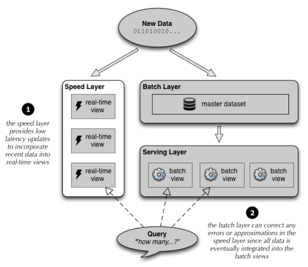

--NEWH
**Brewer's CAP theorem**

Understanding trade-offs in **distributed systems**

Using a formal process to understand the trade-offs in your selection process will help drive your focus towards things most important.

"When a distributed data system is partitioned, it can be *consistent* or *available*, but *not both*."

--NEWV
**Consistency** (!= the consistency in ACID) - multiple clients reading the same items from **replicated partitions** get consistent results

**high Availability** - knowing that the distributed database will always allow database clients to update items without delay (=> internal communication failures between replicated data should not prevent updates)

**Partition tolerance** - ability for the system to keep responding to client requests even if there is a communication failure between database partitions

CAP theorem only applies when something goes wrong in communication => the more reliable your network the less chance you need to think about CAP

--NEWV
CAP theorem helps you understand that once you partition your data you must consider the availability <-> consistency spectrum in case of network failures


--NEWH
## Data Processing in Lambda Architecture

--NEWV
*batch systems*: MapReduce

very simple conceptually: map phase + reduce phase

*real-time systems*: spark, storm, ...

technologically much more complex

See next 2 sessions

--NEWH
## Data Storage in Lambda Architecture

--NEWV
**NoSQL - Not Only SQL**

See following lectures

= set of concepts that allow the rapid and efficient processing of datasets with a focus on performance, reliability and agility. Core themes:

* free of joins
* schema-free
* works on many processors
* uses shared-nothing commodity computers
* supports linear scalability

--NEWV
## NoSQL concepts

--NEWV
.1. **keeping components simple** to promote reuse: linux pipe philosophy

NoSQL systems are often created by integrating a large number of modular functions that work together <=> traditional RDBMS: mammoth system

<small>`cat data.csv | grep "chr1" | cut -f 2 | sort | uniq -c`</small>

e.g. one function allows sharing of objects in RAM, another function to run batch jobs, yet another function for storing documents

NoSQL system interfaces are broader than regular STDIN and STDOUT (i.e. using line delimiters): can be documents, REST, JSON, XML, ... services

--NEWV
.2. using **application tiers** to simplify design

By segregating an application into tiers you have the option of modifying or adding a specific layer instead of reworking an entire application => separation of concerns

* Lambda Architecture
* user interface <-> middle tier <-> database layer

--NEWV
Where do you put functionality? trade-offs:

* RDBMS: have been along for long time and are mature => much functionality added to database tier
* NoSQL: most of application functionality is in middle tier


--NEWV
.3. speeding performance by **strategic use of RAM, SSD, and disk** (e.g. Spark)

you: in Leuven

* getting something from RAM = your backyard
* getting something from SSD (solid state drive) = somewhere in your neighbourhood
* getting something from disk = traveling to Saudi Arabia
* getting something from the network = traveling to Jupiter

--NEWV
.4. keep your cache current using **consistent hashing**

Hash string or checksum = process that calculates sequence of letters by looking at each byte of a document (e.g. MD5, SHA-1)

Consistent hashing: quickly tells you if a new query or document is the same as one already in your cache. Consistent hashing occurs when two different processes running on different nodes in your network create the same hash for the same object

Changing a single bit in the object/file changes the MD5 sumd5sum

<small>`my_file.txt => 5a13448726555d031061aef7432b45c3`</small>

--NEWV
In principle: possible that 2 different documents create the same hash value = **hash collision**

* MD5 algorithm: 128 bit string => occurs once every 10^38 documents => if you generate a billion documents a second it would take 10 trillion times the age of the universe for a single accidental collision to occur

Consistent hashing: can also be used to assign documents to specific database nodes

--NEWV
.5. **ACID vs BASE** - two methods of reliable database transactions

= "transaction control models"

RDBMS => ACID<br/>
NoSQL => BASE

Example: bank transaction: making sure that the two processes in figure happen either together or not at all


--NEWV
**ACID**

* **Atomicity**: exchange of funds in example must happen as an all-or-nothing transaction
* **Consistency**: your database should never generate a report that shows a withdrawal from saving without the corresponding addition to the checking account => block all reporting during atomic operations (=> impact on speed!)
* **Isolation**: each part of the transaction occurs without knowledge of any other transaction
* **Durability**: once all aspects of transaction are complete, it's permanent

--NEWV
Software to handle these rules = very complex (50-60% of the codebase => new databases often do not support database-level transaction management in their first release)

All transaction control strategies: depend on resource locking

ACID systems: focus on consistency and integrity of data above all other considerations (temporarily blocking reporting mechanisms is a reasonable compromise to ensure systems return reliable and accurate information) => pessimistic

--NEWV
**BASE**

* **Basic Availability**: information and service capability are "basically available" (you can always generate a report)
* **Soft-state**: some inaccuracy is temporarily allowed and data may change while being used to reduce the amount of consumed resources
* **Eventual consistency**: eventually, when all service logic is executed, the systems is left in a consistent state

e.g. shopping carts: no problem if back-end reports are inconsistent for a few minutes; it’s more important that the customer can actually purchase things

--NEWV
ACID: focuses on consistency <-> BASE: focuses on availability

BASE = *optimistic*: eventually all systems will catch up and be consistent

BASE systems tend to be much simpler and faster <= don't have to write code that deals with locking and unlocking resources

ACID vs BASE != black vs white; continuum

--NEWV


--NEWV
.6. **Horizontal scalability** through **database sharding**

in RDBMS: automatic sharding

As number of servers grows: higher chance that one will go down => duplicate data to backup or mirrored system = data **replication**

--NEWH
## Types of NoSQL data stores

* **documents stores**: for storing hierarchial data structures (e.g. document search)
* **key/value stores**: simple data storage systems that use a key to access a value (e.g. image stores, browser history, Amazon S3)
* **column stores**: sparse matrix systems that use a row and column as key
* **graph stores**: for relationship-intensive problems (e.g. social network, gene network)

--NEWV
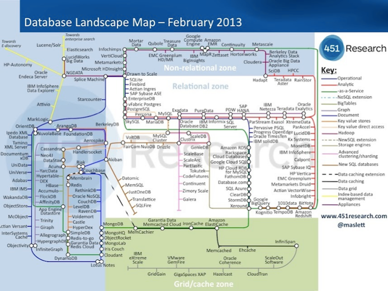

--NEWV
**document stores**

--NEWV

Focus on storage of *documents* rather than rows and columns

Some: provide SQL-like interface

Some: provide mapreduce processing

--NEWV
**column stores**

--NEWV
proprietary Google BigTable implementation

database = multiple tables, each containing addressable rows, each row with a set of values in columns

important differences with RDBMS:

* each row can have a different set of columns (but common set of "column groups")
* tables are intended to have many (>1,000-1,000,000) columns

--NEWV
**graph stores**

--NEWV
Use nodes, edges and properties as primary elements

Different underlying infrastructures

--NEWV
**key/value stores**

--NEWV
Very specific use, very simple, very fast

Provides only a single way to access values (only commands: `put`, `get`, `delete`)

Not possible to query value

--NEWV
Simple database that when presented with a string (the key) returns an arbitrary large blob of data (the value)

Has no query language; can only put stuff in and get stuff out

Like a dictionary

--NEWV


--NEWV
Very scalable: fast retrieval of values regardless of the number of items in your store

Don't have to specify data type for the value => you can store whatever you want (as a blob)

Up to the application to determine what type of data it is and what to do with it

Keys can be many things: path names to files, artificially generated strings, SQL queries (as string), ...

--NEWV


--NEWV


--NEWV
Only 2 rules for key/value store:

1. Distinct keys: you can never have two items with the same key
2. No queries on values: you cannot select a key/value pair using any information from the value <-> RDBMS: constrain the result set using the `WHERE` clause

--NEWV


--NEWV
**Use cases** for key/value stores

* Storing web pages: key = URL; value = HTML code of webpage
* Amazon Simple Storage Service (S3)
  * uses a simple REST API (see later in course)
  * = key/value store, plus metadata and access control

--NEWV
**Implementations**

e.g. Redis [http://redis.io](http://redis.io)

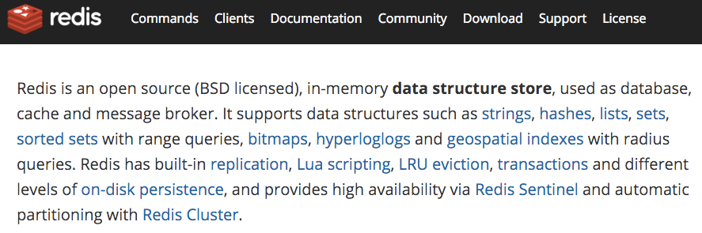

--NEWV
[http://try.redis.io](http://try.redis.io)

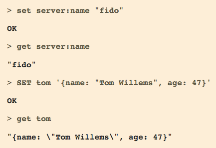

--NEWV
Redis python API

`sudo pip install redis`

```python
import redis
r = redis.StrictRedis(host='localhost', port=6379, db=0)
r.set('foo','bar')
r.get('foo')
```

Redis docker image

<small>`docker run -it --link some-redis:redis --rm redis sh -c 'exec redis-cli -h "$REDIS_PORT_6379_TCP_ADDR" -p "$REDIS_PORT_6379_TCP_PORT"'`</small>

--NEWH
## An example - small scale

--NEWV
**Employee database**
Database containing all information about employees: name, address, contract(s), ... (One individual can have several subsequent contracts)

Can be kept in relational database (e.g. mysql), but we can still use Lambda Architecture principles

Key: immutability

--NEWV
Using **views**

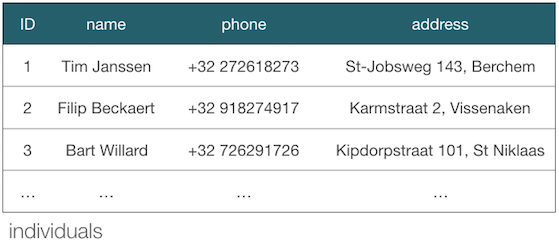


--NEWV
```
CREATE VIEW v_current_individuals AS
SELECT i.id, i.name, i.phone, i.address
FROM individuals i
WHERE EXISTS (
  SELECT * FROM contracts c
  WHERE c.individual_id = i.id
  AND c.start_date <= CURDATE()
  AND CURDATE() <= c.stop_date
)
```

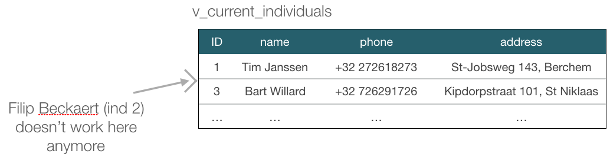

=> every individual who ever worked at the company stays in the "individuals" table

--NEWH
## An example - larger scale

--NEWV
**What do we have? What do we need?**

The data: twitter at Belgian scale (= not optimized/tweaked)

* profile data (username, real name, gender, language, ...)
* user clicks "follow" on profile of other user
* actual (re)tweets (timestamp, sender, text)

--NEWV
The uses:

* key influencers (= those with most retweets)
* suggest new people to follow
* what are the trending hashtags?
* twitter analytics


--NEWV
**Batch layer - the ground truth**

immutable => add, don't update

* necessary for profile data?
* can e.g. be regular csv files

--NEWV
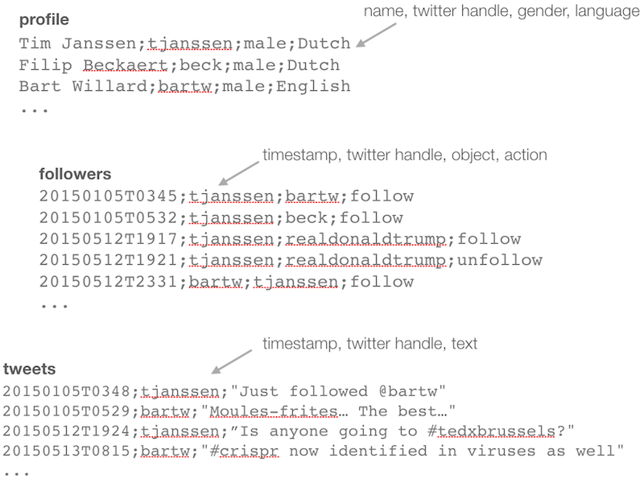

--NEWV
**Serving layer**

convert data in batch layer into form that can answer the uses

--NEWV
*twitter analytics*

*Once per month*: run over data in batch layer and count => store in key-value store


--NEWV
*trending hashtags*

*Continuously*: run over data in batch layer, count and sort. If it takes too long: include speed layer (either same computation as serving but only on new data, or completely different incremental algorithm)

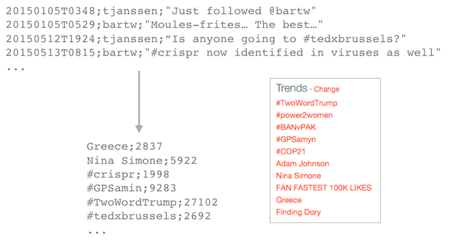

--NEWV
*Suggest new people to follow. Who are key influencers? Who are more popular?*

*Continuously* run over data in batch layer, create nodes and links in graph.

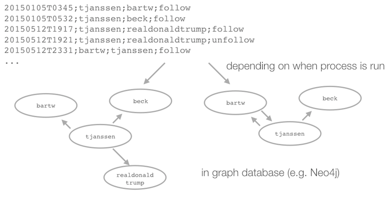

--NEWV
Who are more popular?

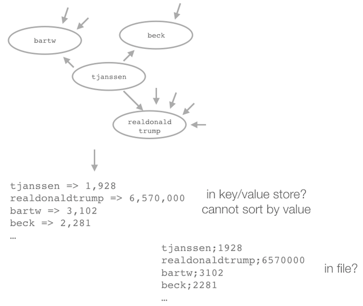

--NEWV
Who are key influencers? (e.g. defined as how many followers in 3 steps; easy when using graph database)

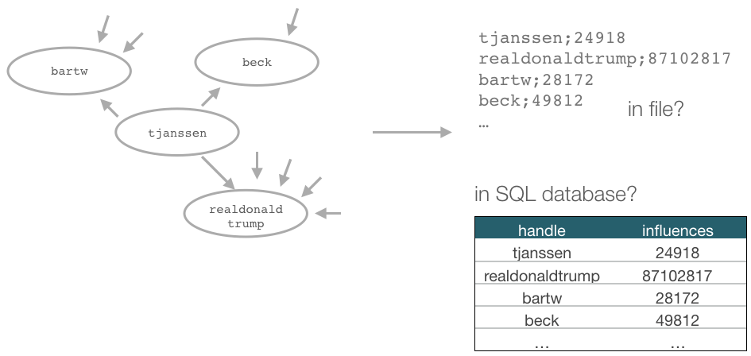
