# I0U19A<br/>Management of large-scale omics data

Prof Jan Aerts, [VDA-lab](http://vda-lab.be), KU Leuven<br/>
jan.aerts@kuleuven.be<br/>
http://teaching.vda-lab.be


Note:
To set things up:
* start mongo docker image: `docker run -d -p 27017:27017 -p 28017:28017 jandot/mongo-i0u19a` => `docker exec -it <this-image> /bin/bash` to interact
* start neo4j docker image: `docker run -d -p 7474:7474 jandot/neo4j-i0u19a` => after wait: go to http://localhost:7474

--NEWV
Today - NoSQL databases

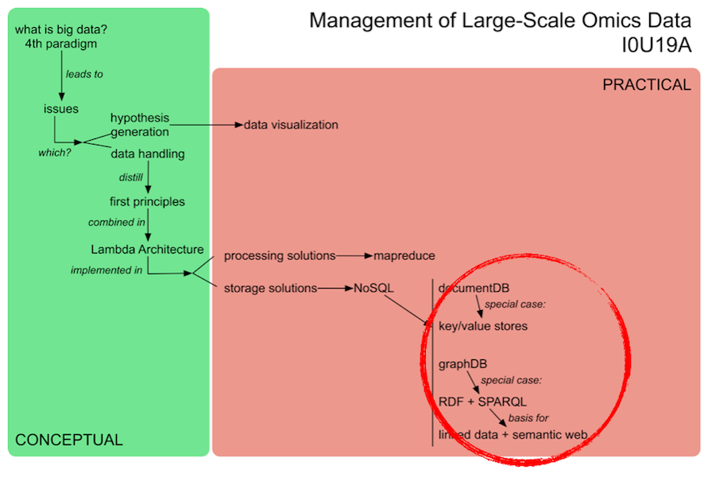

--NEWV
## :: NoSQL databases overview ::

* key/value stores
* document-oriented databases
* column-oriented databases (skipped in this course)
* graph databases
  * RDF

--NEWH
But first...

**JSON**

**REST**

--NEWV
## :: Intermezzo - JSON ::

--NEWV
Same principle as XML and YAML ("Yet Another Markup Language")

Example:
```
{ code:"I0D54A",
  name:"Big Data",
  lecturer:"Jan Aerts",
  keywords:["data management","NoSQL","big data"],
  students:[
    {student_id:"u0359851", name:"Jariani Abbas"},
    {student_id:"u0290360", name:"Anurag Chaturvedi"},
    {student_id:"u0193120", name:"Stefanie De Coster"}]}
```

--NEWV
### JSON syntax rules

* Data is in key/value pairs (each in quotes, separated by colon)
* Data is separated by commas
* Curly braces hold objects
* Square brackets hold arrays

--NEWV
**JSON values** can be numbers, strings, booleans, arrays, objects, or null

**JSON arrays** can contain multiple values (incl objects)

```
["data management","NoSQL","big data"]

[{student_id:"u0372837", name:"Jariani Abbas"},
 {student_id:"u9274918", name:"Anurag Chaturvedi"},
 {student_id:"u0183928", name:"Stefanie De Coster"}]
```

**JSON objects** contain multiple key/value pairs

```
{student_id:"u0372837", name:"Jariani Abbas"}
```

--NEWV
nested objects

```
{ code:"I0D54A",
  name:"Big Data",
  lecturer:"Jan Aerts",
  keywords:["data management","NoSQL","big data"],
  students:[
    {student_id:"u0359851", name:"Jariani Abbas"},
    {student_id:"u0290360", name:"Anurag Chaturvedi"},
    {student_id:"u0193120", name:"Stefanie De Coster"}]}
```


--NEWV
## Intermezzo - REST

--NEWV
### REST = REpresentational State Transfer

= way to interact with data through HTTP ("web service")

Basic design principles:
* Use HTTP methods explicitely
* Be stateless
* Expose directory-like URIs
* Return XML or JSON

--NEWV
### Use HTTP methods explicitely

1-to-1 mapping of CRUD (Create, Read, Update, Delete) methods to HTTP methods (Post, Get, Put, Delete)

E.g. get the first 5 documents from the `beers` collection in the `i0u19a` database:

```
curl http://192.168.99.100:28017/i0u19a/beers/?limit=5
```

--NEWV
### Be stateless

REST Web Service application includes within the HTTP headers and body of a request all of the parameters, context, and data needed by the server-side component to generate a response

--NEWV
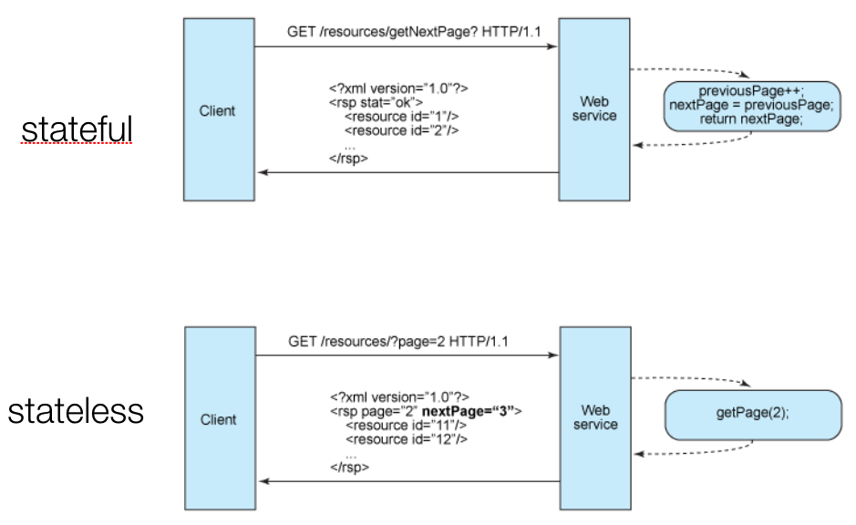

--NEWV
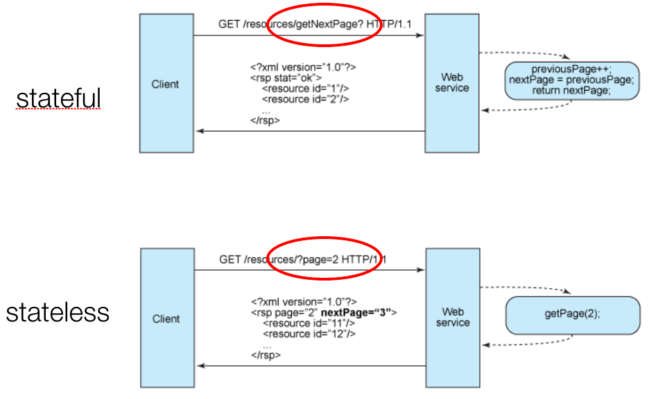

--NEWV
### Expose directory structure-like URIs

REST web service URIs should be so simple that they are easy to guess

REST interface = "self-documenting"

e.g. `http://www.myservice.org/posts/2008/12/10/{topic}`

--NEWV
### Ensembl REST API

Which genes on chr7 between 140424943 and 140624564? => see http://rest.ensembl.org

```
curl http://rest.ensembl.org/overlap/region/human/7:140424943-140624564?feature=gene -H 'Content-type:application/json'
```

--NEWV
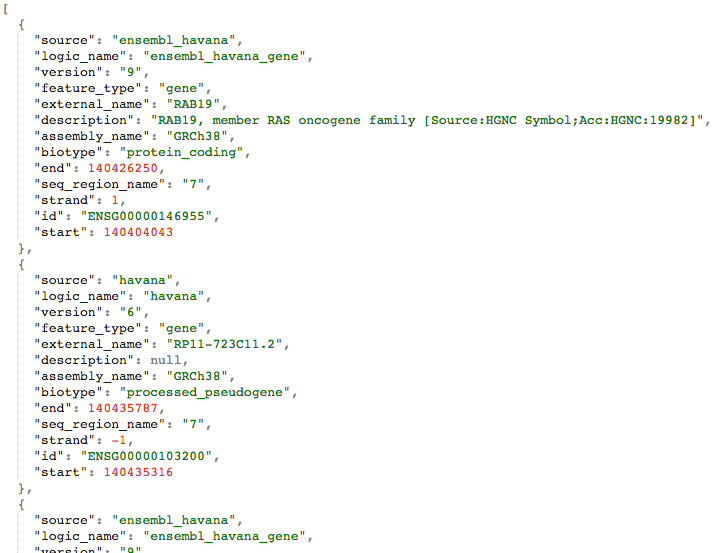

--NEWH
## :: Document databases ::

--NEWV
Horizontally scalable

Schema-less...: each record exists in a document rather than a row with well-defined columns

Adding features in RDBMS: `ALTER my_table` (can take hours) <-> document stores: just add new key

...but not free-form: many databases use JSON

--NEWV
### Core differences with RDBMS

Relational database defines columns at the *table* level, whereas document store defines fields at the *document* level.

Joining (RDBMS) => linking + embedding (document store)

--NEWV
Joining tables (RDBMS)

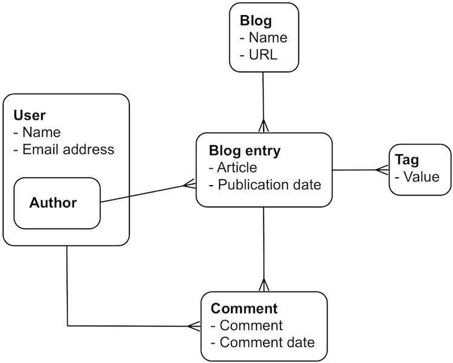

--NEWV
Linking and embedding objects (document-oriented databases)

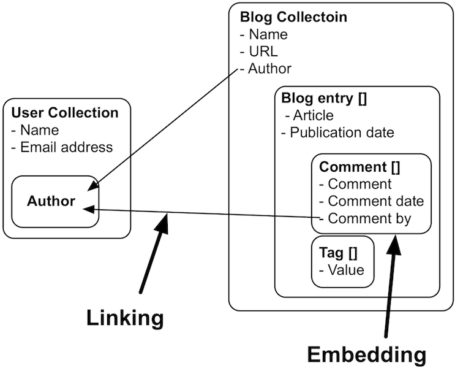

--NEWV
### Advantages of this design

Embedded objects returned in same query as parent object => only 1 trip to database

Objects in same collection are generally stored sequentially on disk => fast retrieval

If document model matches your domain, much easier to understand than normalized relational database

--NEWV
### Difference with key/value stores

key/value stores: key is important, value not searchable <-> document stores: value is searchable, key is almost never used explicitely or seen

In document store: "key" is part of the document itself

--NEWV
### Data modelling

Depends on your use case!

Choice will greatly affect complexity and performance of the queries!

E.g. genotypes (individual + SNP = genotype): 2 options:
* per individual
* per SNP

--NEWV
Per individual

```
{name: "Tom",
 ethnicity: "African",
 genotypes: [
   { snp: "rs0001",
     genotype: "A/A",
     position: "1_8271" },
   { snp: "rs0002",
     genotype: "A/G",
     position: "1_12729" },
   { snp: "rs0003",
     genotype: "C/C",
     position: "1_82719" },
   ...]}
{name: "John",
 ethnicity: "Caucasian",
 ...
```

--NEWV
Per SNP

```
{snp: "rs0001",
 position: "1_8271",
 genotypes: [
   { name: "Tom",
     ethnicity: "African",
     genotype: "A/A" },
   { name: "John",
     ethnicity: "Caucasian",
     genotype: "A/A" },
   ...]},
{snp: "rs0002",
 ...
```

--NEWV
### Document database implementation

* CouchDB
* MongoDB
* ...

--NEWV
### MongoDB


--NEWV
hu(mongo)us


--NEWV
### MongoDB - The Basics

1. MongoDB system runs as a server/daemon, similar to MySLQ (<-> sqlite3)
2. One *database* can have one or more *collections* (=~ table in relational database system)
3. Collections are made up of one or more *documents* (=~ row in relational database system)
4. Documents are made up of one or more *fields* (=~ column in relational database system)
5. Indexes in MongoDB act like indexes in RDBMS

Stores documents as BSON (= binary version of JSON)

--NEWV
has built-in
* auto-partitioning
* replication
* load balancing
* file storage
* data aggregation

--NEWV
### mongod and mongo

`mongod` = server/daemon; uses `/data/db` to store database

* run as root: `sudo mongod`

`mongo` = interactive shell (uses JavaScript); connects to `/data/db` database

* `show dbs`
* `use my_test` (creates `my_test` database if doesn't exist)
* `show collections`
* `exit`

--NEWV
### Queries in MongoDB

Useful reference: [http://openmymind.net/mongodb.pdf](http://openmymind.net/mongodb.pdf)

--NEWV
### Inserting data

```
db.unicorns.insert({name: "Aurora", gender: "f", weight: 450})
db.unicorns.insert({name: "Solnara", dob: new Date(1985, 6, 4, 2, 1),
                    loves:["apple", "carrot","chocolate"],
                    weight:550, gender:"f"})
db.unicorns.insert({name:"Ayna", dob: new Date(1998, 2, 7, 8, 30),
                    loves: ["strawberry", "lemon"],
                    weight: 733, gender: "f"})
db.unicorns.insert({name:"Kenny", dob: new Date(1997, 6, 1, 10, 42),
                    loves: ["grape", "lemon"],
                    weight: 690, gender: "m"})
db.unicorns.insert({name: "Raleigh", dob: new Date(2005, 4, 3, 0, 57),
                    loves: ["apple", "sugar"],
                    weight: 421, gender: "m"})
db.unicorns.insert({name: "Leia", dob: new Date(2001, 9, 8, 14, 53),
                    loves: ["apple", "watermelon"],
                    weight: 601, gender: "f"})
```

Inserts 6 new documents in the `unicorns` collection (and creates `unicorns` collection if it doesn't exist yet)

--NEWV
### ObjectID

Every new document automatically gets a time-stamped `_id` (of type `ObjectID`)

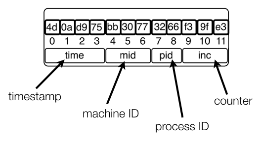

first part = timestamp => sorting by `_id` == sorting by creation time

--NEWV
### Querying

Get all unicorns
```
db.unicorns.find()
db.unicorns.find({})
db.unicorns.find({},{})
```

Get all male unicorns
```
db.unicorns.find({gender: "m"})
db.unicorns.find({"gender": "m"})  <= quotes around key often optional
db.unicorns.find({gender: "m"},{})
```

Get all unicorns heavier than 600kg
```
db.unicorns.find({weight: {$gt: 600}})
```

Get all male unicorns heavier than 600kg
```
db.unicorns.find({gender:"m", weight: {$gt: 600}})
```

--NEWV
* `$lt` => less than
* `$lte` => less than or equal to
* `$gt` => greater than
* `$gte` => greater than or equal to
* `$ne` => not equal to

`find` is smart when working with arrays
```
db.unicorns.find({loves:"lemon"})
```

Return only selected fields: use the second `{}`
```
db.unicorns.find({},{loves:1})
db.unicorns.find({loves:"lemon"},{loves:1,name:1})
```

Digging deeper
```
db.persons.find({"language.programming": "java"}) <= needs quotes
```

--NEWV
`$exists` => check for presence of absence of a field
```
db.unicorns.find({loves: {$exists: false}}) <= returns Aurora
```

`$or` => speaks for itself... (`$and` is the default!)
```
db.unicorns.find({gender:"f", $or: [{loves: "apple"},{loves: "orange"},{weight:{$lt:500}}]})
```

sorting
```
db.unicorns.find().sort({gender:1, weight: -1})
```

counting
```
db.unicorns.count({gender:"m"})
db.unicorns.find({gender:"m"}).count()
```

--NEWV
`findOne()` == `find().limit(1)`, but returns result nicely formatted
```
db.persons.findOne()
```

To get help:
* `db.help()`
* `db.persons.help()`

--NEWV
### Aggregation in mongodb

=~ data processing pipelines

[https://docs.mongodb.com/manual/aggregation/](https://docs.mongodb.com/manual/aggregation/)

--NEWV
Processed from top to bottom


--NEWV
Aggregation methods: see [https://docs.mongodb.org/manual/reference/operator/aggregation-pipeline/](https://docs.mongodb.org/manual/reference/operator/aggregation-pipeline/)

* _match_: filter
* _group_: consumes all input and outputs one document for each group
* _project_: reshape each document
* _sample_: randomly select number of documents
* _facet_: processes multiple aggregation pipelines within a single stage on the same set of input documents
* _bucket_: categorizes documents into groups
* ...

Note:
db.beers.aggregate([{$group: { _id: "$brewery", count: { $sum: 1}}}, {$match: { count: {$gt: 10}}}])

--NEWV
### Mapreduce in mongodb


--NEWV
### Limitations of MongoDB

No referential integrity

High degree of denormalization => might need to update something in many places

Lack of predefined schema = double-edged sword:
* Must have a model in your app
* Objects within a collection can be completely inconsistent in their fields

--NEWV
### Linking vs embedding

e.g. blog posts with comments, and authors

2 collections:
* authors
* blog posts

--NEWV
authors, e.g.
```
{name: "John Doe",
 gender: "m",
 affiliation: "KU Leuven",
 _id: ObjectID("512d05")}
```

blogposts, e.g.
```
{title: "My blog post",
 author: ObjectID("512d05"),  <== linking
 publish_date: new Date(1998,2,7,8,30),
 contents: "This is the full text of the post",
 comments: [
   {author: ObjectId("512d05"), text:"Good post"},  <== embedding
   {author: ObjectId("73b1c0"), text:"This is nonsense..."}  <== embedding
 ]}
```

--NEWV
How do you combine these? For example: to list all comments written by a male author.

* Has to be done at the *application* level, not at the *database* level.
* Get the `ObjectID`s of all male authors from the `authors` collection => search the `blogposts` collection with these `ObjectID`s

--NEWV
### REST interface for mongodb

Runs on port 28017; see [http://docs.mongodb.org/ecosystem/tools/http-interfaces](http://docs.mongodb.org/ecosystem/tools/http-interfaces)

Only allows `GET`

```
curl http://127.0.0.1:28017/<database>/<collection>/
```

To query for `{name: "Leia"}`:
```
curl http://127.0.0.1:28017/i0u19a/unicorns/?filter_name=Leia
```

To combine conditions:
```
curl http://127.0.0.1:28017/i0u19a/unicorns/?filter_gender=f&limit=2
```

--NEWV
### CouchDB


--NEWV
= "Cluster Of Unreliable Commodity Hardware"

[http://couchdb.apache.org](http://couchdb.apache.org)

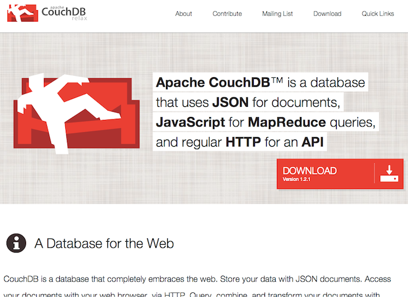

--NEWV
Robustness unmatched by most other databases.

Thrives even when connectivity is only rarely available.

No *ad hoc* querying! (<=> mongodb); uses *views* on the data.

All calls to database are through REST interface.

--NEWH
## :: Graph databases ::

--NEWV


--NEWV
### Graph databases 101

Store data that is organized as a graph.

graph = generalized connected data structure

Directed vs undirected; multigraphs; weighted vs unweighted

Relational databases: aggregate operations on sets<br/>
Graph databases: hopping around relationships between records

Very expressive => easy to model any type of data (but: no guarantee that a particular graph is fit for purpose)

--NEWV
### What is a graph?

`G = (V,E)`

graph = set of **vertices** and **edges** (edge = connection between two vertices)

vertices = nodes; edges = links

Vertices and edges: can have properties

--NEWV


--NEWV


--NEWV
### Describing a graph

**order** of graph = number of nodes

**size** of graph = number of edges

graph **density** = how much its nodes are connected; dense = number of edges is close to maximal number of edges
* for undirected: \\(\frac{2 |E|}{|V|(|V|-1)}\\)
* for directed: \\(\frac{|E|}{|V|(|V|-1)}\\)

**degree** of a node: how many edges are connected to the node (**in-degree** vs **out-degree**)

--NEWV
**distance** between nodes = number of edges in shortest path

**diameter** of graph = maximum distance in a graph

**d-regular graphs**: if max degree is equal to min degree `d`

**path** = sequence of edges which connect a sequence of different vertices

**connected graph**: there exists a path between any 2 vertices

--NEWV
### centrality measures for nodes

* **degree centrality**: node is connected to many other nodes => = node degree
* **betweenness centrality**: how many critical paths go through this node? Without these nodes, there would be no way for 2 neighbours to communicate.

\\(C\_B(i)=\frac{\sum\limits\_{j \neq k} g\_{jk} (i)}{g\_{jk}} \xrightarrow[]{normalize} C'\_B = \frac{C\_B(i)}{(n-1)(n-2)/2}\\)

where denominator = number of vertex pairs excluding the vertex itself

Note:
* g_jk(i) = number of shortest paths between j and k, going through i
* g_jk = total number of shortest paths between j and k

--NEWV
* **closeness centrality**: how much is node in the "middle" of things, not too far from the centre => inverse total distance to all other nodes

\\(C\_C(i) = \frac{1}{\sum\limits\_{j=1}^N d(i,j)} \xrightarrow[]{normalize} C'\_C(i) = \frac{C\_C(i)}{N-1}\\)

--NEWV


<small>[A] betweenness centrality; [B] closeness centrality; [D] degree centrality</small>

--NEWV
### Graph mining<br/> - [a] Community finding
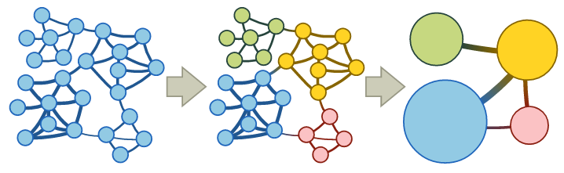

Community = group of nodes that are densely connected internally

--NEWV
Approaches:
* *null models*: community = set of nodes for which the connectivity deviates the most from the null model
* *block models*: identify blocks of nodes with common properties
* *flow models*: community = nodes among which flow persists for a long time once entered

--NEWV
Example: _infomap_ algorithm (flow model; implemented in python modules NetworkX, igraph, graph-tool)


Demo: http://www.mapequation.org/apps/MapDemo.html

--NEWV
### Graph mining<br/> - [b] Link prediction
* _dynamic_ setting: predict the likelihood of a future association between two nodes
* _static_ setting: infer missing links (e.g. find interactions between proteins)

Algorithms based on similarity matrix between nodes

--NEWV
Similarity measures between nodes:
* _graph distance_
* _common neighbours_: two strangers who have a common friend may be introduced by that friend
* _Jaccard's coefficient_: probability that 2 nodes have the same neighbours
* _frequency-weighted common neighbours (Adamic/Adar predictor)_: counts common features (e.g. links), but weighs rare features more heavily

--NEWV
Similarity measure between nodes (cont'd):
* _preferential attachment_: new link between nodes with high number of links is more likely than between nodes with low number of links
* _exponential damped path counts (Katz measure)_: the more paths there are between two nodes and the shorter these paths are, the more similar the nodes are
* _hitting time_: random walk starts at node A => expected number of steps required to reach node B
* _rooted pagerank_: idem, but periodical reset to prevent that 2 nodes that are actually close are connected through long deviation

--NEWV
### Graph mining<br/> - [c] Subgraph mapping
* [A] feed-forward loop
* [B] tree chain
* [C] four-node feedback loop
* [D] three-node feedback loop
* [E] bi-parallel
* [F] bi-fan


--NEWV
### Graph database implementations

* Neo4J
* OrientDB
* AllegroGraph
* Virtuoso (RDF)
* ...

--NEWV
### Neo4j


--NEWV
### Installing neo4j

As easy as:
* download neo4j (www.neo4j.org)
* untar
* run `bin/neo4j start`
* go to `http://localhost:7474/webadmin`

Or even easier: use one of the docker containers
* `docker run -p 7474:7474 -v $HOME/neo4j/data:/data neo4j`
* `docker run -d -p 7474:7474 jandot/neo4j-i0u19a`

--NEWV
### Neo4j web interface

webadmin: [http://localhost:7474/webadmin](http://localhost:7474/webadmin)
* Dashboard - overview with database statistics
* Data browser - direct manipulation of the graph
* Console - scripting and querying the graph
* Server info - raw management details about the server
* Index manager - creating and removing default indexes

browser: [http://localhost:7474/browser](http://localhost:7474/browser)

--NEWV
### Accessing and querying graph data

--NEWV
Example graph

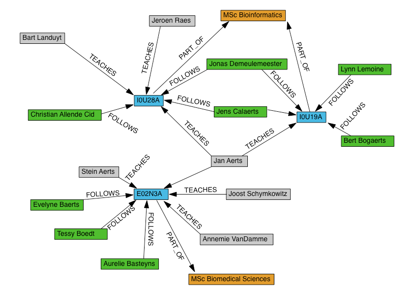

--NEWV
### Cypher

SQL-like: pattern-matching style - ASCII art

[docs.neo4j.org/chunked/milestone/cypher-query-lang.html](docs.neo4j.org/chunked/milestone/cypher-query-lang.html)

[player.vimeo.com/video/50389825](player.vimeo.com/video/50389825)

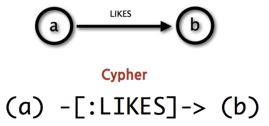

--NEWV
To find

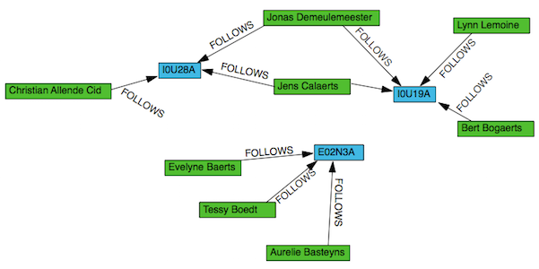

Use this pattern:

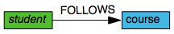

<small>`MATCH (s:Student)-[r:FOLLOWS]->(c:Course) RETURN s,r,c`</small>

--NEWV
Cypher reference card: [http://neo4j.com/docs/stable/cypher-refcard/](http://neo4j.com/docs/stable/cypher-refcard/)

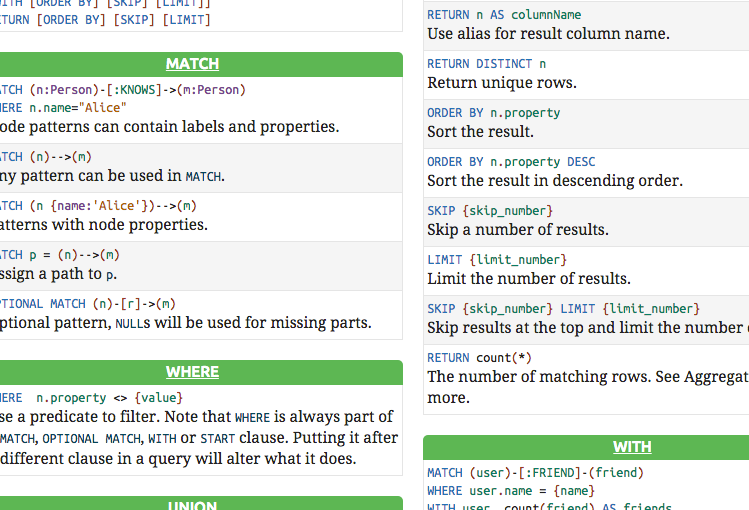

--NEWV
### Create data

```
CREATE (jan:Teacher {name:"Jan Aerts",email:"jan.aerts@kuleuven.be"})
CREATE (stein:Teacher {name:"Stein Aerts",email:"stein.aerts@kuleuven.be"})
CREATE (joost:Teacher {name:"Joost Schymkowitz",email:"joost.schymkowitz@kuleuven.be"})
CREATE (annemie:Teacher {name:"Annemie Vandamme",email:"annemie.vandamme@kuleuven.be"})
CREATE (jeroen:Teacher {name:"Jeroen Raes",email:"jeroen.raes@kuleuven.be"})
CREATE (bart:Teacher {name:"Bart Landuyt",email:"bart.landuyt@kuleuven.be"})
CREATE (christian:Student {name:"Christian Allende Cid"})
CREATE (evelyne:Student {name:"Evelyne Baerts"})
...
CREATE (e02n3a:Course {code:"E02N3A",name:"Bioinformatics and Systems Biology"})
CREATE (i0u19a:Course {code:"I0U19A",name:"Management of Large-Scale Omics Data"})
CREATE (i0u28a:Course {code:"I0U28A",name:"Omics Techniques and Data Analysis"})
CREATE (jan)-[:TEACHES]->(e02n3a)
CREATE (jan)-[:TEACHES]->(i0u19a)
CREATE (jan)-[:TEACHES]->(i0u28a)
CREATE (stein)-[:TEACHES]->(e02n3a)
CREATE (joost)-[:TEACHES]->(e02n3a)
CREATE (annemie)-[:TEACHES]->(e02n3a)
CREATE (bart)-[:TEACHES]->(i0u28a)
CREATE (jeroen)-[:TEACHES]->(i0u28a)
CREATE (jan)-[:TEACHES]->(e02n3a)
CREATE (christian)-[:FOLLOWS]->(i0u28a)
CREATE (jonas)-[:FOLLOWS]->(i0u28a)
CREATE (jens)-[:FOLLOWS]->(i0u28a)
CREATE (jonas)-[:FOLLOWS]->(i0u19a)
```

--NEWV
### Queries

Get all nodes
```
MATCH (n) RETURN n
```

Get all nodes with a label
```
MATCH (n:Course) RETURN n
```

Get all nodes given an attribute
```
MATCH (n:Course {code:"I0U19A"}) RETURN n
MATCH (n:Course) WHERE n.code = "I0U19A" RETURN n
```

Note:
Using genes and diseases
* `MATCH (n) RETURN n LIMIT 50`
* `MATCH (n:Gene) RETURN n LIMIT 50`
* `MATCH (n:Disease) RETURN n LIMIT 50`

--NEWV
Get all relationships
```
MATCH (a:Course {course:"E02N3A"})--(b) RETURN b
```

Get all relationships, also returning relationship itself
```
MATCH (a:Course {code:"E02N3A"})-[r]-(b) RETURN a,r,b
```

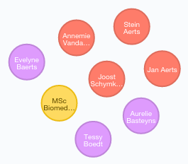
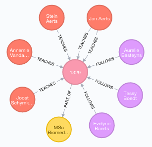

Note:
* `MATCH (a {name:"A2M"})-[r:AFFECTS]-(b:Disease) return a,b,r`

--NEWV


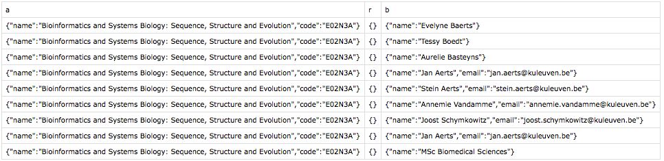

--NEWV
Only outgoing relationships
```
MATCH (a:Course {code:"E02N3A"})-->(b) RETURN b
```


Only incoming relationships
```
MATCH (a:Course {code:"E02N3A"})<--(b) RETURN b
```

... while referring to the relationship
```
MATCH (a:Course {code:"E02N3A"})-[r]->(b) RETURN a,r,b
```
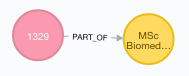

--NEWV
Get all relationships of a certain type
```
MATCH (a:Course {code:"E02N3A"})<-[:TEACHER]-(b) RETURN b
```
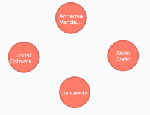

... is the same as
```
MATCH (b)-[:TEACHES]->(a:Course {code:"E02N3A"}) RETURN b
```

--NEWV
Including the other node and relationship
```
MATCH (a)-[r:TEACHES]->(b:Course {code:"E02N3A"}) RETURN a,r,b
```
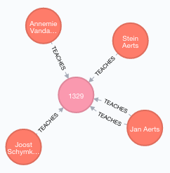

--NEWV
Making more than 1 step: finding all co-teachers of Stein Aerts
```
MATCH (a:Teacher {name:"Stein Aerts"})-[:TEACHES]->()<-[:TEACHES]-(b) RETURN b
```

... or the same thing with more information
```
MATCH (a:Teacher {name:"Stein Aerts"})-[r1:TEACHES]->(c)<-[r2:TEACHES]-(b) RETURN a,r1,c,r2,b
```

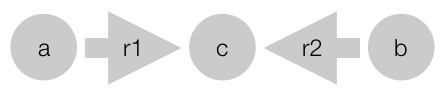
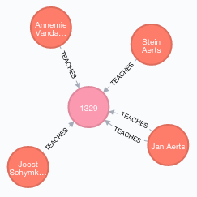

--NEWV
Finding 3-node feedback loop


```
MATCH (v1)-[r1:INTERACTS_WITH]->(v2)-[r2:INTERACTS_WITH]->(v3),
      (v1)-[r3:INTERACTS_WITH]->(v3)
RETURN v1,r1,v2,r2,v3,r3
LIMIT 2;
```

--NEWV
### HTTP REST interface

* `get /` => the root URL of the server
* `get /db/data` => the root for data access
* `get /db/data/node/0` => node 0
* `get /db/data/node/0/relationships/in` => incoming relationships

See [http://neo4j.com/docs/stable/rest-api.html](http://neo4j.com/docs/stable/rest-api.html)

--NEWV
### Data modelling

--NEWV
### General modelling guidelines

Use **nodes** to represent **things**

Use **relationships** to represent **connections**

Use **node properties** to represent entity attributes (e.g. metadata such as timestamps, version numbers, ...)

Use **relationship properties** to express strength, weight or quality of a relationship, plus relationship metadata

--NEWV


--NEWV
### Modelling pitfalls

Example: email provenance problem domain

--NEWV
*Iteration 1*
```
CREATE (alice {username: "alice"})
CREATE (bob {username: "bob"})
CREATE (charlie {username: "charlie"})
CREATE (davina {username: "davina"})
CREATE (edward {username: "edward"})
CREATE (alice)-[:ALIAS_OF]->(bob)
CREATE (bob)-[:EMAILED]->(charlie)
CREATE (bob)-[:CC]->(davina)
CREATE (bob)-[:BCC]->(edward)
```

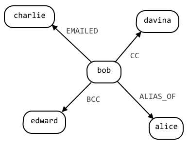

--NEWV
Problem: missing the most critical part: the *email*

```
MATCH (bob {username:"Bob")-[e:EMAILED]->(charlie {username:"charlie") RETURN e
```

... tells us that emails have been sent, but nothing about the emails themselves

--NEWV
*Iteration 2*: add email nodes

```
CREATE (email {id:"1234", content:"Hi Charlie, ... Kind regards, Bob"})

CREATE (bob)-[:SENT]->(email)
CREATE (email)-[:TO]->(charlie)
CREATE (email)-[:CC]->(davina)
CREATE (email)-[:CC]->(alice)
CREATE (email)-[:BCC]->(edward)
```

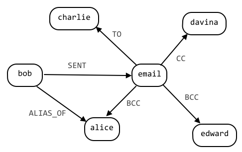

--NEWV
Getting all emails that Bob sent to Charlie while copying Davina and Alice

```
MATCH (bob {username:'bob'})-[:SENT]->(email)-[:TO]->(charlie {username:'charlie'}),
      (email)-[:CC]->(davina {username:'davina'}),
      (email)-[:CC]->(alice {username:’alice'})
RETURN bob,email,charlie,davina,alice
```

Problem: what with email forwards and replies? No time-dimension.

--NEWV
*Iteration 3*: consider replies and forwards as separate emails

```
CREATE email = {id:"0", content:"email"}
CREATE (bob)-[:SENT]->(email)
CREATE (email)-[:TO]->(charlie)
CREATE (email)-[:TO]->(davina)
CREATE reply_1 = {id:"1", content:"response"}
CREATE (reply_1)-[:REPLY_TO]->(email)
CREATE (davina)-[:SENT]->(reply_1)
CREATE (reply_1)-[:TO]->(bob)
CREATE (reply_1)-[:TO]->(charlie)
CREATE reply_2 = {id:"2", content:"response 2"}
CREATE (reply_2)-[:REPLY_TO]->(reply_1)
CREATE (bob)-[:SENT]->(reply_2)
CREATE (reply_2)-[:TO]->(charlie)
CREATE (reply_2)-[:TO]->(davina)
```

--NEWV
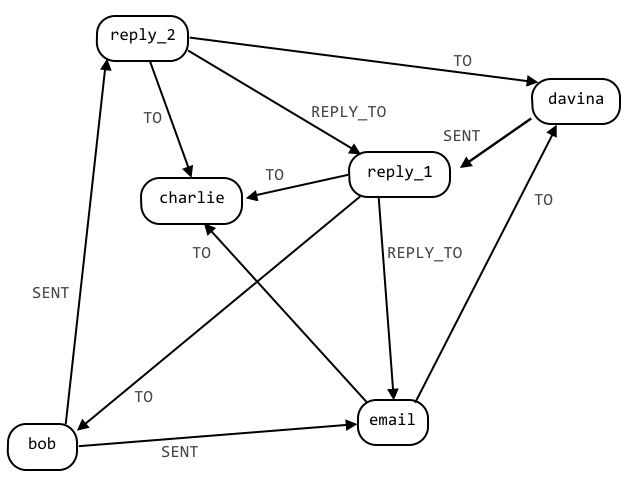

--NEWH
## :: Linked Data ::

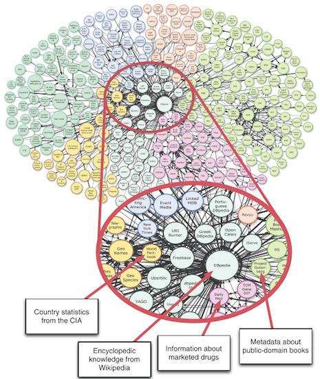

--NEWV
Above: data is stored in silos

What if you want to combine data from different sources?

--NEWV
### Linked Data scoring system

* **1 star**: Data is **available on the web**, in whatever format (e.g. a scanned image)
* **2 stars**: Data is available as **machine-readable** structured data (e.g. Excel spreadsheet)
* **3 stars**: Data is available in **non-proprietary** format (e.g. csv)
* **4 stars**: Data is published using **open data standards**
* **5 stars**: All of the above, plus **link to other people's data**

--NEWV
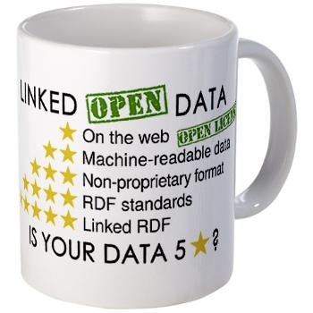

--NEWV
### Linked Data principles

1. Use URIs as names for things
2. Use HTTP URIs so people can look up those things
3. When someone looks up a URI, provide useful information
4. Include links to other URIs

--NEWV
### Principle 1 - Use URIs as names for things

URI = Universal Resource Identifier (= generalized version of URL)

"thing" can be anything: book, person, gene, war, certain row in a CSV file

e.g.:
* definition of a "gene": [http://dbpedia.org/page/Gene](http://dbpedia.org/page/Gene)
* gene CYP2D6: [http://dbpedia.org/page/CYP2D6](http://dbpedia.org/page/CYP2D6)

--NEWV
### Principle 2 - Use HTTP URIs

URIs already exist:
* books: ISBN number (e.g. Charles Dickens' *The Old Curiosity Shop*: 0140437428) => URI = isbn:0140437428
* scientific papers: doi or pubmed ID (e.g. cow genome paper: doi 10.1126/science.1169588) => URI = doi:10.1126/science.1169588

but: how do we resolve these numbers? Cannot put them in web-browser

=> use HTTP URIs, e.g. http://dx.doi.org/10.1126/science.1169588
resolves to [http://www.sciencemag.org/content/324/5926/522](http://www.sciencemag.org/content/324/5926/522)

--NEWV
### Principle 3 - Provide useful information behind URI

When you create a URI to name a thing, either refer to an existing web resource, or make your own. Resource should be machine-readable.

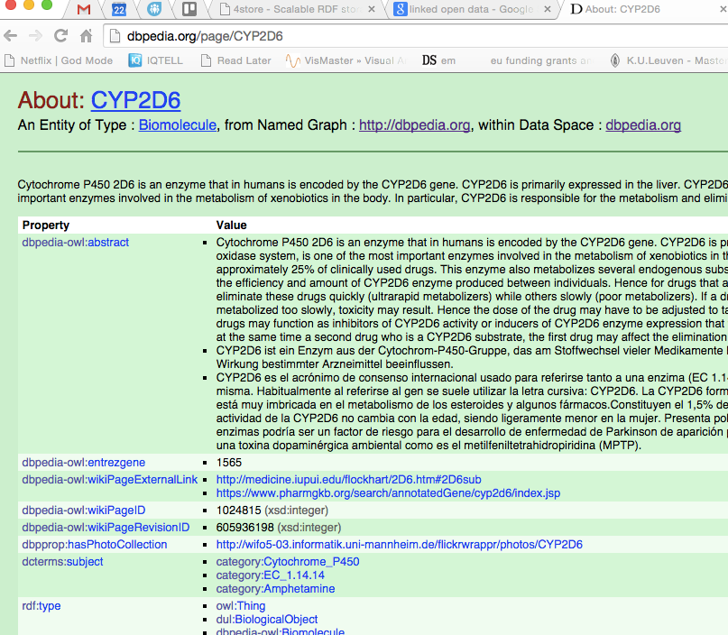

--NEWV
### Principle 4 - Link to other things

Don't reinvent the wheel (i.e. refer to an existing URI for e.g. the concept of "gene" instead of setting up a new one)

==> "Linked" Data

--NEWV
### RDF Data Model

RDF = Resource Description Framework

information is organized in *triplets*
* subject: URL
* predicate: URL
* attribute: URL or string/number

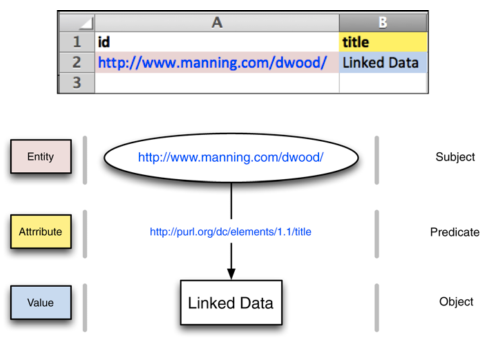

--NEWV
`curl -L http://dbpedia.org/data/Bonobo.n3`

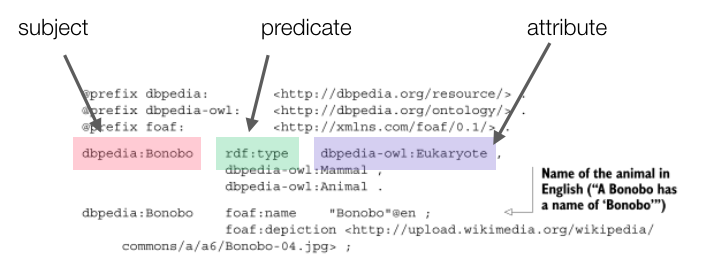

--NEWV
### SPARQL - Querying Linked Data

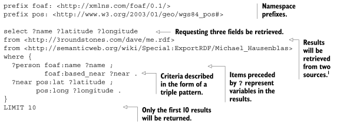

--NEWV
### Relation to regular graph databases


--NEWV
In graph database example before: "stein" node had properties "name" ("Stein Aerts") and "email" ("stein.aerts@kuleuven.be")

--NEWV
In Linked Data:
1. Convert to subject - predicate - attribute<br/>
<small>stein - name - "Stein Aerts"<br/>
stein - email - "stein.aerts@kuleuven.be"<br/>
stein - worksAt - KULeuven</small>
1. Use resolvable URIs<br/>
<small>http://my_rdf_store/stein - http://xmlns.com/foaf/0.1/name - "Stein Aerts"<br/>
http://my_rdf_store/stein - http://xmlns.com/foaf/0.1/mbox - "stein.aerts@kuleuven.be"<br/>
http://my_rdf_store/stein - http://xmlns.com/foaf/0.1/workplaceHomepage - http://www.kuleuven.be</small>

--NEWV
### RDF stores/databases

Many options:
* 4store
* 3store
* Allegro
* Virtuoso
* Redland RDF Library
* ...

--NEWH
## Questions?